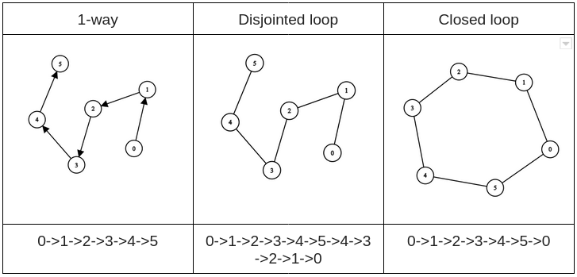

# multi_robot_sim

This package provides a mutli robot simulator in an simulated real world outdoor path.
[Docs](https://rawcdn.githack.com/wndxwilson/multi_robot_sim/e9aa495f432d58035a326a04864b7c2e786c6ea1/doc/html/index.html)

#### Features
- Generate gazebo world using geospatial data from OpenStreetMap [osm2gazebo](https://github.com/wndxwilson/osm2gazebo)
- Able to spawn, delete and monitor each robot individually
- Robots navigates independently
- RESTful API to interface with the simulator

## 1 Setup
### Docker image
```
docker pull taiwilson5/multi_robot_sim:v1
docker run -p 6080:80 -p 5000:5000 --shm-size=512m taiwilson5/multi_robot_sim:v1
```

### Install from source
1. Install [ROS melodic](http://wiki.ros.org/melodic/Installation/Ubuntu)
2. Install ROS dependencies
    ```
    sudo apt-get install ros-melodic-navigation
    sudo apt-get install ros-melodic-slam-gmapping
    ```
3. Install Python dependencies
    ```
    sudo apt-get install python3-pip python3-yaml
    sudo pip3 install rospkg catkin_pkg
    pip3 install Flask
    pip3 install networkx
    pip3 install numpy
    ```

4. Create catkin_ws
    ```
    mkdir -p ~/catkin_ws/src
    cd ~/catkin_ws/
    catkin_make
    ```
5. Clone the repo
    ```
    cd ~/catkin_ws/src
    git clone https://github.com/wndxwilson/multi_robot_sim.git
    cd ..
    catkin_make
    ```
6. Setup the environment
    ```
    cd ~/catkin_ws/src/multi_robot_sim/shell_scripts
    ./setup.sh
    ```
## 2 Create the world file
1. Install [osm2gazebo](https://github.com/wndxwilson/osm2gazebo)
2. Generate the sdf file
3. Run the import `importWorld`

## 3 Running the simulator
The Flask server will be run on localhost:5000
```
roslaunch multi_robot_sim multi_robot_sim.launch world_name:=<insert world name> yaml_path:=<insert yaml path> 
```

## 4 Navigation modes
The simulator has 3 navigation modes:
1. Mode0 - 1-way
2. Mode1 - Disjointed Loop
3. Mode2 - Continous Loop



## 5 Logging
When the simulator is closed, it will generate the log files and saved as multi_robot_sim/logs/

## 6 API 
<table>
  <tr>
    <td><strong>Method</strong></td>
    <td><strong>Endpoint</strong></td>
    <td><strong>Description</strong></td>
    <td><strong>Query parameters</strong></td>
    <td><strong>Response</strong></td>
  </tr>
  
  <tr>
    <td>POST</td>
    <td>/api/robot</td>
    <td>To spawn the robot in the virtual environment</td>
    <td>robot_name (String) : The robot name of the robot (default=””) <br>node (int) : The starting node location in which the robot will be spawned </td>
    <td>Failed, Invalid node, Robot already exist, Success</td>
  </tr>
  <tr>
    <td></td>
    <td colspan="2">Example Request</td>
    <td colspan="2">/api/robot?robot_name=tb3_0&node=602062234</td>
  </tr>
  
  <tr>
    <td>DELETE</td>
    <td>/api/robot</td>
    <td>To despawn the robot in the virtual environment</td>
    <td>robot_name (String) : The robot name of the robot (default=””)</td>
    <td>Failed, Robot does not exist, Success</td>
  </tr>
  <tr>
    <td></td>
    <td colspan="2">Example Request</td>
    <td colspan="2">/api/robot?robot_name=tb3_0</td>
  </tr>
  
   <tr>
    <td>GET</td>
    <td>/api/robot</td>
    <td>To get the robot or robots status</td>
    <td>robot_name (String) : The robot name of the robot (default=””)</td>
    <td>
      <p>
        { <br>
        "robot_name" : { <br>
        &nbsp &nbsp"status code" : (int),<br>
        &nbsp &nbsp"status" : (string),<br>
        &nbsp &nbsp"position" : (list [x,y]), <br>
        &nbsp &nbsp"lnglat_pos" : (list [lon,lat]), <br>
        }<br>
        }
      </p>
    </td>
  </tr>
  <tr>
    <td></td>
    <td colspan="2">Example Request</td>
    <td colspan="2">/api/robot?robot_name=tb3_0</td>
  </tr>
  
  <tr>
    <td>POST</td>
    <td>/api/navigation/move</td>
    <td>To command a specific robot to navigate through the specified nodes.</td>
    <td>robot_name (String) : The robot name of the robot (default=””) <br>
        node (int[]) : The list of nodes the robot is suppose to travel <br>
        mode (int) :  Navigation mode: mode0: 1-way, mode1: disjointed loop, mode2:closed loop
    </td>
    <td>Failed, Moving</td>
  </tr>
  <tr>
    <td></td>
    <td colspan="2">Example Request</td>
    <td colspan="2">/api/robot?robot_name=tb3_0</td>
  </tr>
  <tr>
    <td></td>
    <td colspan="2">Example JSON body</td>
    <td colspan="2"> { <br>
        "robot_name" : "tb3_0", <br>
        "nodes" : [602062234,5146316735], <br>
        "mode" : "mode2" <br>
        }
    </td>
  <tr>
    
   <tr>
    <td>POST</td>
    <td>/api/navigation/pause</td>
    <td>To pause the robot from navigating.</td>
    <td>robot_name (String) : The robot name of the robot (default=””)
    </td>
    <td>Failed, Robot does not exist, Success</td>
  </tr>
  <tr>
    <td></td>
    <td colspan="2">Example Request</td>
    <td colspan="2">/api/navigation/pause?robot_name=tb3_0</td>
  </tr>
  
  <tr>
    <td>POST</td>
    <td>/api/navigation/resume</td>
    <td>To resume the robot navigationavigating.</td>
    <td>robot_name (String) : The robot name of the robot (default=””)
    </td>
    <td>Failed, Robot does not exist, Success</td>
  </tr>
  <tr>
    <td></td>
    <td colspan="2">Example Request</td>
    <td colspan="2">/api/navigation/resume?robot_name=tb3_0</td>
  </tr>
  
  <tr>
    <td>POST</td>
    <td>/api/navigation/cancel</td>
    <td>To cancel the robot navigation.</td>
    <td>robot_name (String) : The robot name of the robot (default=””)
    </td>
    <td>Failed, Robot does not exist, Success</td>
  </tr>
  <tr>
    <td></td>
    <td colspan="2">Example Request</td>
    <td colspan="2">/api/navigation/cancel?robot_name=tb3_0</td>
  </tr>

</table>

## Acknowledgements
The launch of mutli-robot is based on https://github.com/yangfan/ros_sim
